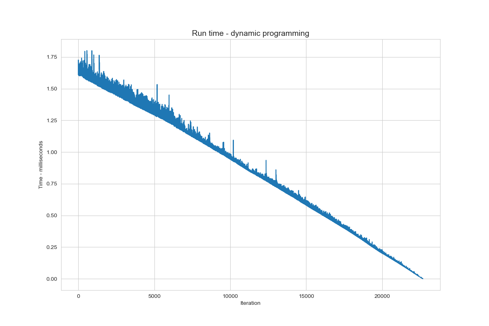
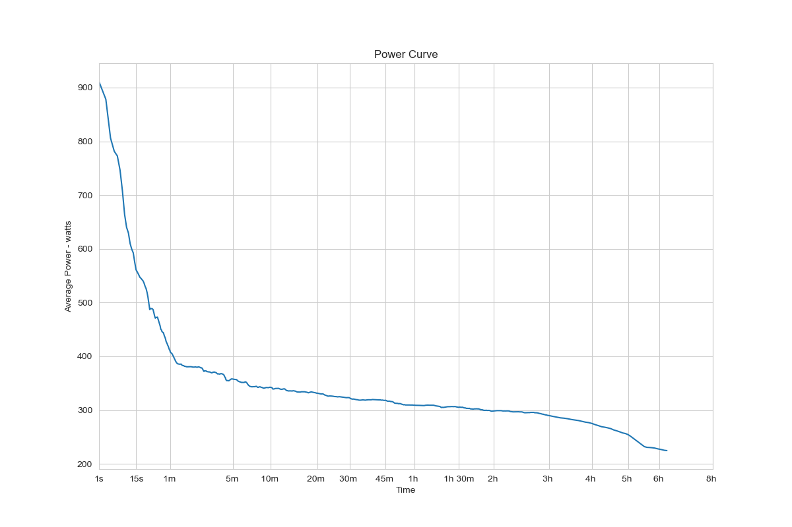
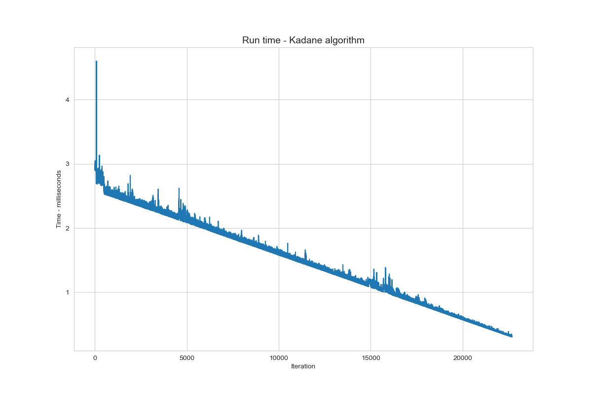
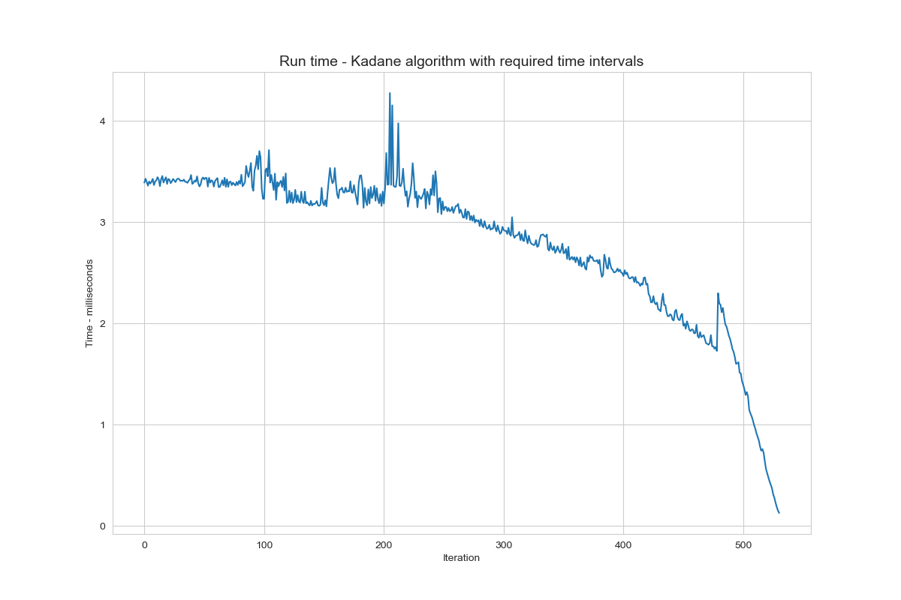

# power-curve

# initial edits

EJ Wong: 
I have added a source code that calculates a running average across a selected timeframe and a second algorithm that runs the greatest average output over a specific timeframe. The second algoritm is similar to Kadane's Algorithm but uses an maximum average subarray of size n compared to just a max subarray.

Please see [`codeWong.py`](src/codeWong.py). 

Reproducable code can be done here:

```
make wong
```

See more on Kadane's Algorithm: https://en.wikipedia.org/wiki/Maximum_subarray_problem

Camden Black Ingersoll:

I included a dynamic programming approach for finding best efforts. It uses the cumulative sums from a previous iteration to calculate the current sums more quickly. This requires fewer calculations as the time interval increases.

<p>
To reproduce, paste ride.gpx file in the data directory.
</p>

Parse the gpx file:
```
make parse
```
Calculate best efforts and create power curve figure:
```
make critical-power-curve
```
We can add timers to compare different approaches. Although running time is variable and dependents on hardware and other factors, it can provide a useful visualize when the environment is constant:
```
Time to calculate best efforts:  19.56735825 seconds
```



<p>We can plot the best efforts for the time intervals with a log scale on the x axis:</p>



<p>
We can optimize this further by only calculating the relevant best efforts for 5, 10, 15 seconds, 1 min, 5 min, 10 min, etc... Strava uses an x scale with progressive intervals: the spacing between x ticks is 1 second for 0 to 1 minute efforts, and 5 minutes for efforts over 3 hours.
</p>
<p>
As the duration of an effort increases, each value contributes less to the average (this follows from the law of large numbers). Therefore, we don't need to calculate the best efforts for every possible duration to make an accurate power curve. 
</p>
Compare the relative running time using all time intervals, and the minimum required time intervals to construct the power curve:

```
make kadane-efficient
```






See the [power curve notebook](src/PowerCurve.ipynb) for an approach with vectorization.